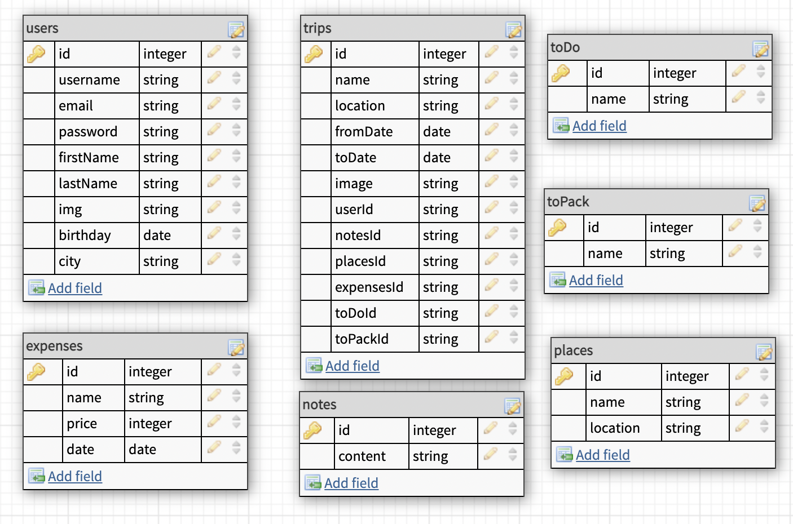
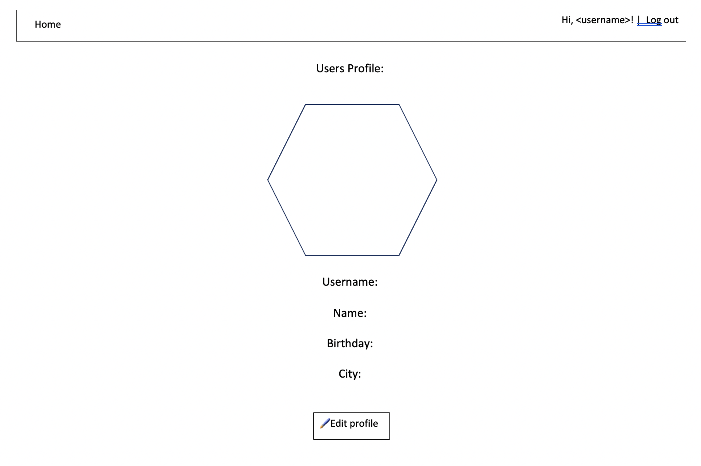
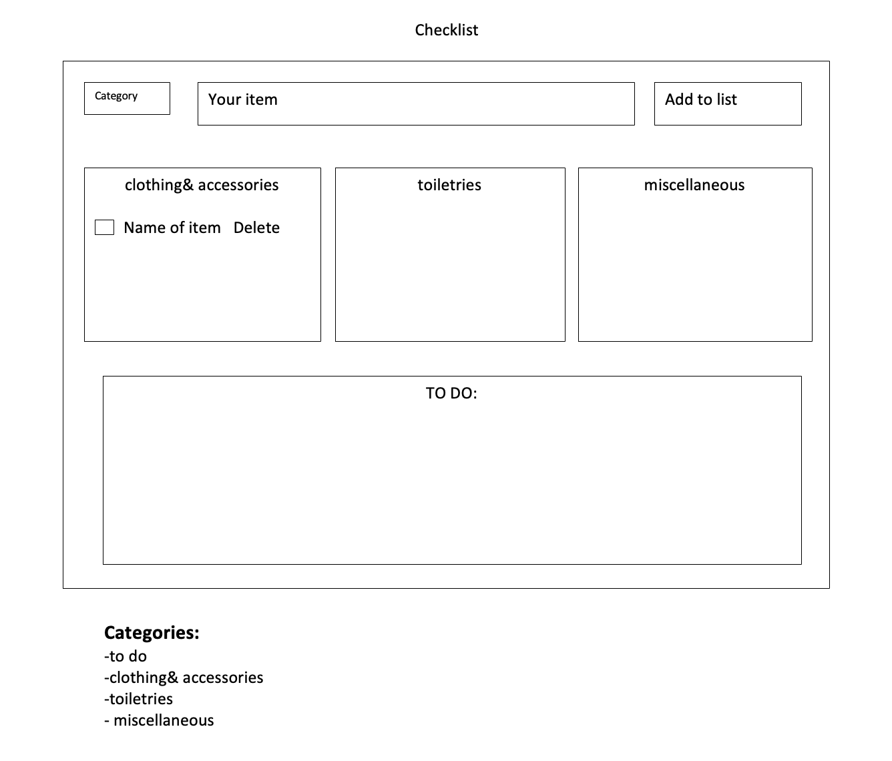

# **Trip Tracker**
## Description
Trip Tracker is an app designed to help users stay organized while traveling. Through TT, users will be able to create a profile and save information about different trips that they are planning. Each trip will include all the tools necessary to stay organized, think ahead and find information relevant to their travel needs. Additionally, users will be able to save information throughout their trip, to reference later or share with friends. 
## User Stories 
### MVP:
- As a user, I want to be able to view a Homepage for the site.
- As a user, I want to be able to Register for an account.
- As a user, I want to Login to view all of my saved information.
- As a user, I want to be able to Logout when I am done using the site, but have information saved in the database.
- As a user, I want to be able to Access my personal information on an account page, and change it if necessary.
- As a user, I want to Navigate to a main trips landing page.
- As a user, I want to Add and delete trips, or search for trips on the main page.
- As a user, For each trip, I want to see a name, date, and photo representing each trip.
- As a user, I want to Click into each trip to go to a trip detail page.
- As a user, I want the trip detail page to have many tools for preparing for a trip
- As a user, I want to view all trip prep tools laid out in a unique grid style, with the ability to build the grid and rearrange the grid.
- As a user, I want to Access each tool to interact with and update the information in the tool.
- As a user, I want to be able to add multiple instances of a tool in case I need more than one to-do list, notepad, etc.
    - These are the tools that a user can access:
        - Trip / Packing Checklist
        - To-Do List
        - Notepad
        - Flight Information
        - Lodging information
        - User-created schedule for trip
        - Trip budget / Expenses

### STRETCH GOALS: 
- As a user, I want to add more tools to my trip grid that access third-party APIs, including these possibilities:
    - Destination weather information
    - Map of interesting locations:
        - Museums
        - Restaurants
        - Tourist attractions / landmarks
        - Coffee shops
        - Antique malls
        - National parks
        - Campsites 
    - Public transportation info
    - Calendar of events happening in the area
    - Language resources
    - Tourist information resources
- As a user, I want to be able to add other users to trips to access the trips and make changes collaboratively
## Group Roles 

Sarah: *The Professional* - Admin (Git manager, Readme, Organization, Details, etc.)

Chris: *The Cleaner* - Front End (HTML, CSS, Design)

Gabe: *The Architect* - Back End (Schemas, Model Building, Auth)

Mariia: *The Messenger* - Communications between Front and Back End (Routes, React, Postman)

All of these roles will also each help with all of the hard-coding, debugging, and feature-building

## Sprints 
Friday

  - Readme finished
  - Group Roles defined
  - Completed wire-frames
  - Made full schema ERD
  - Planned all routes
  - Hard Pitch prepped

Monday

  - Set up App folder / file structure
  - Install all npm packages
  - Set up express and mongo, require all packages
  - Create full component/controller list
  - Build out boilerplate for each app file
  - Stub out all routes
  - Stub all components

Tuesday

  - Run db testing on each route
  - Saved route folder in Postman
  - Work on basic stylesheet setup / work with bootstrap
  - Write out site copy
  - Pull together imagery and colors for styles
  - Build out all routes
  - Build out all components

Wednesday

  - Populate database with seeder information
  - Finish all routes
  - Finish all components
  - Start connecting styles to components
  - Plug in all HTML copy into react components

Thursday

  - Manage adding and removing elements from site (tools in Trip grid)
  - Finish and clean up all routes, components, controllers, schemas, and database.
  - Run tests and debug site
  - Finish MVP

Friday, Saturday, Sunday

  - Further Styling on grid, profile, detail pages, full site usability.
  - Stretch Goals - work on incorporating APIs
  - Stretch Goals - work on connecting and collaborating with other users

## Routes 
| METHOD    | URL                           |           Action          |       Redirect        |
| :---      | :----:                        |            :----:         |         ---:          |
|   GET     | /                             |   Display Homepage        |                       |
|   GET     | /signup                       |   Display Signup Page     |                       |
|   POST    | /signup                       |   Create a new user       |      /profile         |
|   GET     | /login                        |   Display log in page     |                       |
|   POST    | /login                        |   Input user credentials  |      /trips           |
|   GET     | /logout                       |   Redirect to Homepage    |      /                |
|   Get     | /profile                      |   Displays User info      |                       |
|   PUT     | /profile                      |   Edit User info          |                       |
|   DELETE  | /profile                      |   Delete User info        |      /                |
|   GET     | /trips                        |   Displays all trips      |                       |
|   POST    | /trips                        |   Add new trip            |                       |
|   PUT     | /trips                        |   Edit trip               |      /trips           |
|   DELETE  | /trips                        |   Delete trip             |      /trips           |
|   GET     | /trips/:tripId                |   Display specific trip   |                       |
|   PUT     | /trips/:tripId                |   Edit trip info          |      /trips/:id       |
|   Delete  | /trips/:tripId                |   Delete trip info        |      /trips/:id       |
|   GET     | /tools                        |   Display all trip tools  |                       |
|   POST    | /trips/:tripId/tools          |   Create trip tool          |      /trips/:tripId   |
|   PUT     | /trips/:tripId/tools          |   Edit all trip tools     |      /trips/:tripId   |
|   DELETE  | /trips/:tripId/tools          |   Delete trip tool        |      /trips/:tripId   |
|   GET     | /trips/:tripId/tools/:toolId  |   Display trip tool       |      /trips/:tripId   |
|   POST    | /trips/:tripId/tools/:toolId  |   Create trip tool          |      /trips/:id/tools |
|   PUT     | /trips/:tripId/tools/:toolId  |   Edit trip tool          |      /trips/:id/tools |
|   DELETE  | /trips/:tripId/tools/:toolId  |   Delete trip tool        |      /trips/:id/tools |

## Database Schema

## Technologies and APIs
Technologies used for App:
1. React framework (manipulate the DOM based on application data and response to user interaction)
2. Express.js, Node.js (manage routes, handling requests and views)
3. Mongoose (create all necessary for project models)
4. MongoDB (save and store users: authorization info, trips, expenses, checklists etc)
5. Bcrypt, Json web token (take care of security)
6. Axios (pull up backend and API’s data)
7. Dotenv package (hide/ store secret important information)
8. Rowdy-logger (help to visualize routes)

APIs:
https://openweathermap.org/current#min
& TBD

## Wireframes 

